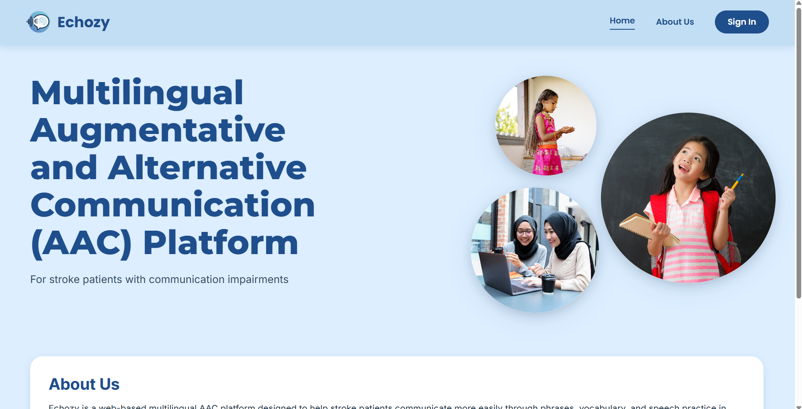
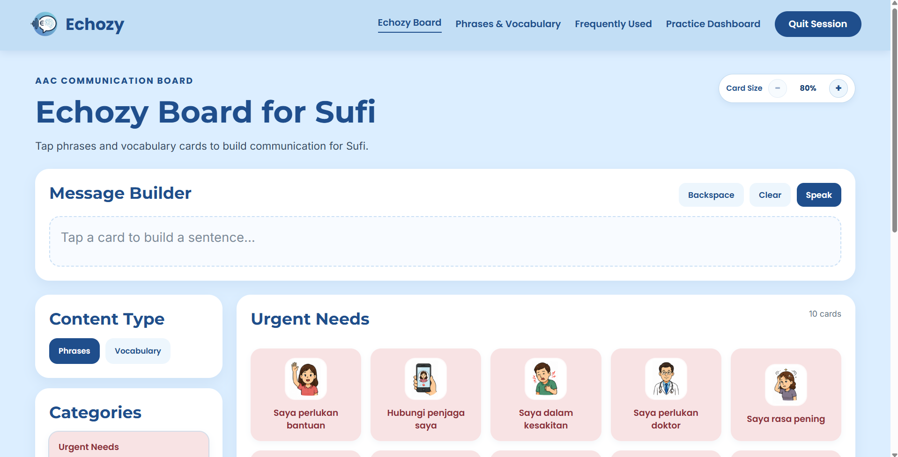
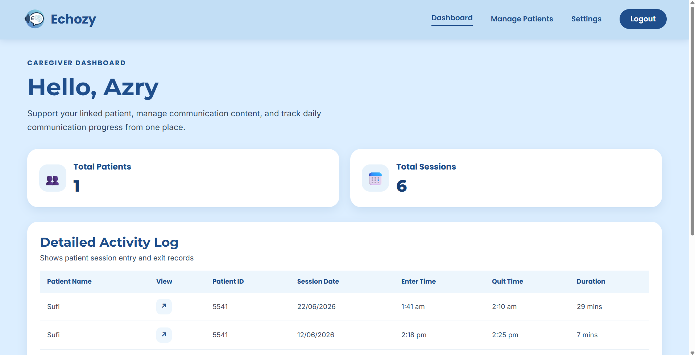
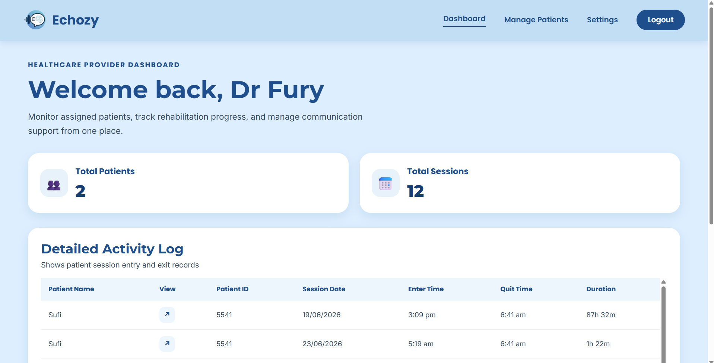
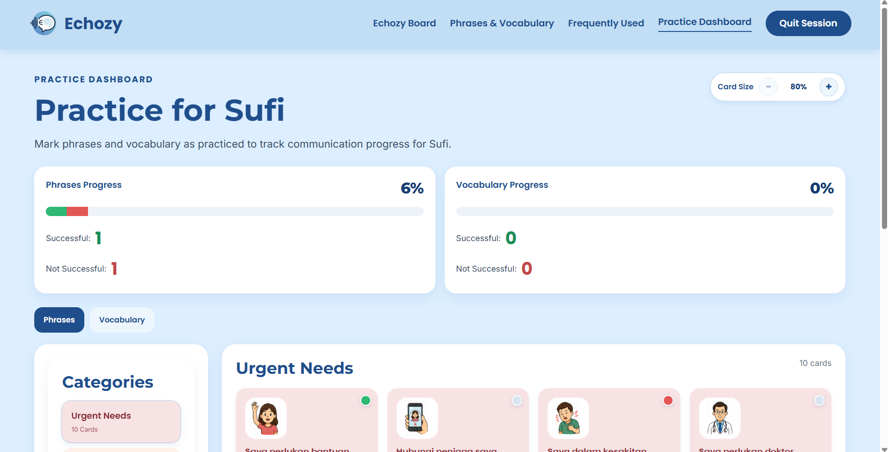
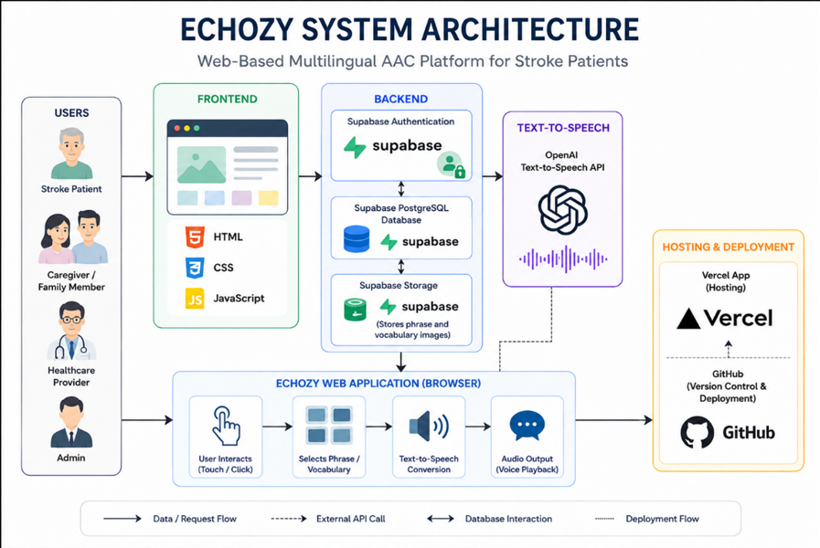

# 🩺 Echozy

> A Web-Based Multilingual Augmentative and Alternative Communication (AAC) Platform for Stroke Patients with Communication Impairments.


---

## 📌 About Echozy

Echozy is a Final Year Project developed as part of the Bachelor of Software Engineering (Hons.) at Universiti Malaysia Sarawak (UNIMAS). It is designed to support stroke patients with communication impairments by providing an accessible, multilingual Augmentative and Alternative Communication (AAC) platform.

Built with HTML, CSS, JavaScript, Supabase, and OpenAI Text-to-Speech, Echozy enables touch-based communication, personalized phrase and vocabulary management, rehabilitation practice, and role-based access for patients, caregivers, healthcare professionals, and administrators.

This project was developed using the Rapid Application Development (RAD) methodology and evaluated through Functional Testing and User Acceptance Testing (UAT).

---

# 🎯 Objectives

- Develop a multilingual AAC platform
- Support Bahasa Malaysia and English
- Provide personalized communication boards
- Assist speech rehabilitation through practice sessions
- Improve communication between patients, caregivers and healthcare professionals

---

# ✨ Key Features

## 👤 Stroke Patient

- Touch-based communication board
- Frequently Used phrases
- Practice Communication
- Text-to-Speech
- Bahasa Malaysia & English
- Responsive interface
- Large accessibility buttons

## 👨‍👩‍👧 Caregiver

- Manage patients
- Personalize phrases
- Personalize vocabulary
- View patient information

## 🏥 Healthcare Provider

- Manage assigned patients
- Monitor communication usage
- View activity logs
- Track rehabilitation progress

## 🔑 Administrator

- Manage default phrases
- Manage default vocabulary
- Manage global communication content

---

# 🖼️ Screenshots

## Homepage



---

## Patient Communication Board



---

## Caregiver Dashboard



---

## Healthcare Provider Dashboard



---

## Practice Communication



---

# 🏗️ System Architecture



Echozy follows a modern web architecture consisting of:

- HTML
- CSS
- JavaScript
- Supabase Authentication
- PostgreSQL Database
- Supabase Storage
- OpenAI Text-to-Speech
- Vercel Deployment

---

# 💻 Technology Stack

| Category | Technology |
|-----------|------------|
| Frontend | HTML5, CSS3, JavaScript |
| Backend | Supabase |
| Database | PostgreSQL |
| Authentication | Supabase Auth |
| Storage | Supabase Storage |
| AI | OpenAI Text-to-Speech API |
| Hosting | Vercel |
| Version Control | Git & GitHub |
| IDE | Visual Studio Code |

---

# 📊 Development Methodology

Rapid Application Development (RAD)

1. Requirements Planning
2. User Design
3. Construction
4. Cutover

---

# 📄 Installation

The complete application source code is maintained in a private repository.

This repository is intended to showcase the project architecture, documentation, screenshots, and system capabilities.

---

# 🔐 Source Code Access

The complete source code is **not publicly available** due to research, academic, and intellectual property considerations.

If you are a recruiter, hiring manager, or academic reviewer and would like to review the implementation, please request access.

---

## 📩 Request Access

You may request temporary access by creating a GitHub Issue using the template below.

Title:

```
Repository Access Request
```

Please include:

- Full Name
- Company / University
- GitHub Username
- Reason for Access

Alternatively, contact me:

📧 **ffarhanah03@gmail.com**

LinkedIn:
(https://www.linkedin.com/in/fatin-farhanah-415266257/)

---

# 🎓 Research Information

**Title**

Echozy: Web-Based Multilingual Augmentative and Alternative Communication (AAC) Platform for Stroke Patients with Communication Impairments

Bachelor of Software Engineering (Honours)

Faculty of Computer Science and Information Technology

Universiti Malaysia Sarawak (UNIMAS)

2026 

---

# 📜 License

This repository is for portfolio and demonstration purposes only.

No source code is distributed in this repository.

All screenshots, documentation and designs remain the intellectual property of the author.

© 2026 Fatin Farhanah

---

## ⚠️ Academic Integrity Notice

This repository is intended to showcase the Echozy project for portfolio and recruitment purposes only.

Students must not copy, reproduce, or submit any part of this project as their own academic work.

Any unauthorized reproduction or academic misuse is strictly prohibited.